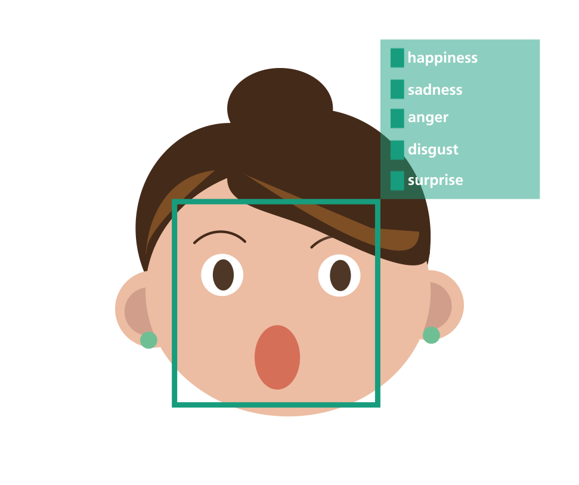

# EmotionScope: Emotion Classifier using Keras

# 

> **`Note 1`**: Use  (recommended) in order to view the jupyter notebooks (nbviewer loads the notebook really fast compared to GitHub). You can see all the codes and the outputs in nbviwer without running the whole code again.

> **`Note 2`**: If you want to edit the notebooks and rerun cells, open notebooks in .

> **`Note 3`**: It has been observed that sometimes both  and  fail to properly render Table of Contents, animations and complex equations for some of the notebooks. In that case, render notebook in  itself.

## Status of Development:

1. Emotion Classifier Model Generation Notebook    
2. Emotion Classifier Model Deployment Notebook    
3. [Emotion Classifier Gradio App](https://7dcaa9ee8b97436782.gradio.live/) 

> **`Note 1`**: Emotion Classifier Gradio App is not running right now. Demo video of Emotion Classifier Gradio App can be found below. You can run the app by rerunning the Emotion Classifier Model Deployment Notebook in .

> **`Note 2`**: The App will be deployed in my personal website in the near future.

## Results:

1. EmotionScope App (App from Hugging Face Spaces is embedded here)

<iframe
	src="https://ancilcleetus-cv-project-01-emotionscope.hf.space"
	frameborder="0"
	width="850"
	height="450"
	allowfullscreen
></iframe>

2. Real-time Emotion Prediction on Webcam Video

3. Emotion Classifier Gradio App Demo: Upload an Image and Discover the Emotions Within

https://github.com/ancilcleetus/My-Learning-Journey/assets/25684256/ebceaeaa-07de-4c09-8ce0-ba7ce70fced0

## Future Improvements Envisioned:

1. Deployment in my personal website [Emotion Classifier App](http://ancilcleetus.com/Personal-Projects/Computer-Vision-Projects/CV_Project_01_EmotionScope)

