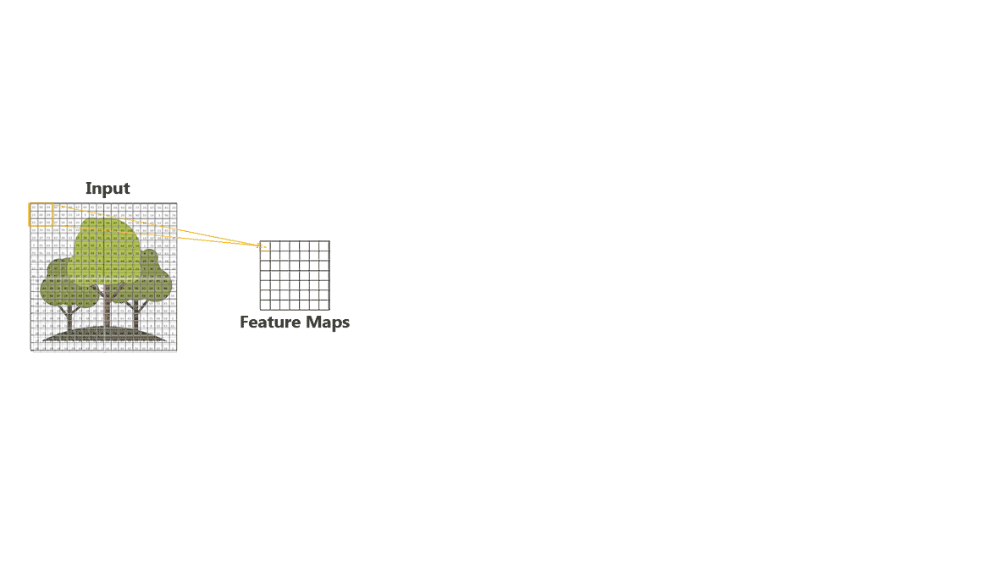

# Computer Vision

# 

> **`Note 1`**: Use  (recommended) in order to view the jupyter notebooks (nbviewer loads the notebook really fast compared to GitHub). You can see all the codes and the outputs in nbviwer without running the whole code again.

> **`Note 2`**: If you want to edit the notebooks and rerun cells, open notebooks in .

> **`Note 3`**: It has been observed that sometimes both  and  fail to properly render Table of Contents, animations and complex equations for some of the notebooks. In that case, render notebook in  itself.

## Status:

1. [Computer Vision Foundations](01-Computer-Vision-Foundations) 
    1. Intro to CNNs    
    2. Cats Vs Dogs Image Classifier from scratch using Keras    
    3. Transfer Learning and Fine-tuning    
    4. VGG16 Model    
2. [Computer Vision Projects](02-Computer-Vision-Projects) 
    1. [Emotion Classifier](02-Computer-Vision-Projects/CV_Project_01_Emotion_Classifier_Keras)    

