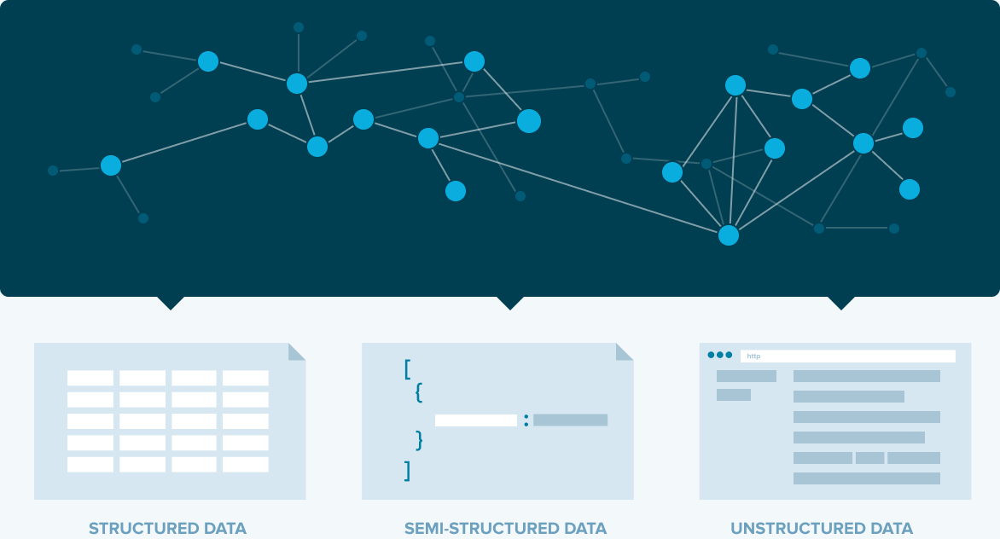

# Data Structures and Algorithms

# 

> **`Note 1`**: Use  (recommended) in order to view the jupyter notebooks (nbviewer loads the notebook really fast compared to GitHub). You can see all the codes and the outputs in nbviwer without running the whole code again.

> **`Note 2`**: If you want to edit the notebooks and rerun cells, open notebooks in .

> **`Note 3`**: It has been observed that sometimes both  and  fail to properly render Table of Contents, animations and complex equations for some of the notebooks. In that case, render notebook in  itself.

## Status:

1. DSA Foundations 
    1. DSA Preparation for Interviews  
    2. Algorithmic Complexity and Big O Notation    
    3. Intro to Data Structures    
    4. Arrays    
    5. Linked Lists    
    6. Stacks    
2. DSA Challenges 
    1. Arrays and Hashing    
    2. Linked Lists    
    3. Stacks    
3. Strivers A2Z DSA Course 
    1. [Step 01: Learn the Basics](03-Strivers-A2Z-DSA-Course/Step-01-Learn-the-Basics) 
        1. Lec 01: Things to Know in Any Language    
4. Strivers SDE Sheet 
    1. Day 01: Arrays    

