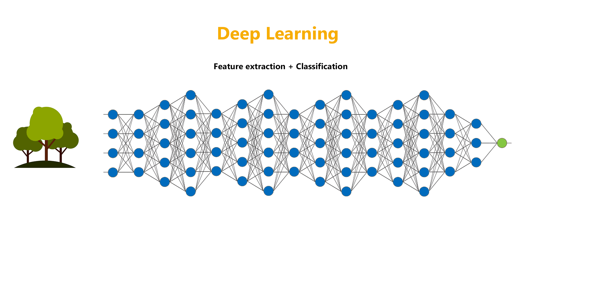

# 

> **`Note`**: Use **nbviewer** (recommended) in order to view the jupyter notebooks. You can see all the codes and the outputs in nbviwer without running the whole code again.

## Status:

1. Deep Learning Foundations 
    1. [Intro to Deep Learning](DL_01_Intro.ipynb)  
    2. [Perceptrons](DL_02_Perceptrons.ipynb)  
    3. [Multi-Layer Perceptrons](DL_03_Multi_Layer_Perceptrons.ipynb)  
    4. [Forward Propagation](DL_04_Forward_Propagation.ipynb)  
    5. [Customer Churn Prediction using ANN](DL_05_Customer_Churn_Prediction_using_ANN.ipynb)  
2. Advanced Deep Learning Concepts 
3. Deep Learning Projects 

