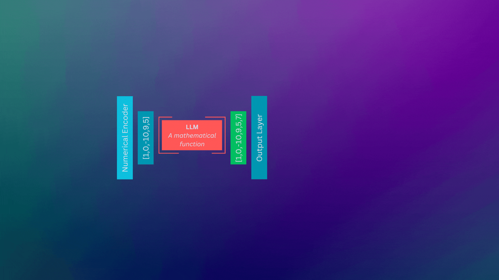

# Generative AI

# 

# 

> **`Note 1`**: Use  (recommended) in order to view the jupyter notebooks (nbviewer loads the notebook really fast compared to GitHub). You can see all the codes and the outputs in nbviwer without running the whole code again.

> **`Note 2`**: If you want to edit the notebooks and rerun cells, open notebooks in .

> **`Note 3`**: It has been observed that sometimes both  and  fail to properly render Table of Contents, media, animations and complex equations for some of the notebooks. In that case, render notebook in  itself.

## Status:

1. [Generative AI Foundations](01-GenAI-Foundations) 
    1. [Microsoft Generative AI For Beginners Course](https://microsoft.github.io/generative-ai-for-beginners) 
    2. [Build a Large Language Model from Scratch](01-GenAI-Foundations/Build-a-Large-Language-Model-from-Scratch) 
    3. [LangChain & Vector Databases in Production Certification by Activeloop](https://learn.activeloop.ai/courses/langchain) 
        1. [Intro](01-GenAI-Foundations/LangChain-and-Vector-Databases-in-Production-Certification-by-Activeloop/01-Intro) 
            1. LangChain 101    
        2. [Large Language Models and LangChain](01-GenAI-Foundations/LangChain-and-Vector-Databases-in-Production-Certification-by-Activeloop/02-Large-Language-Models-and-LangChain) 
            1. Quick Intro to LLMs    
            2. Understanding Tokens    
            3. Build LLM Applications with LangChain    
            4. LLMs Vs Chat Models    
            5. Conversational Capabilities with GPT-4 and ChatGPT    
            6. News Articles Summarizer    
            7. Open Source GPT4All Model    
            8. Popular LLMs in LangChain    
        3. [Learning How to Prompt](01-GenAI-Foundations/LangChain-and-Vector-Databases-in-Production-Certification-by-Activeloop/03-Learning-How-to-Prompt) 
            1. Intro to Prompt Engineering    
            2. Using Prompt Templates    
            3. Getting the Best of Few Shot Prompts and Example Selectors    
            4. Managing Outputs with Output Parsers    
            5. Improving Our News Articles Summarizer    
            6. Knowledge Graphs from Textual Data    
        4. [Keeping Knowledge Organized with Indexes](01-GenAI-Foundations/LangChain-and-Vector-Databases-in-Production-Certification-by-Activeloop/04-Keeping-Knowledge-Organized-with-Indexes) 
2. [Generative AI Projects](02-GenAI-Projects) 
    1. [FirstWordsLLM: LLM built from scratch](02-GenAI-Projects/GenAI_Project_01_FirstWordsLLM) 
        1. Transformer Architecture    

