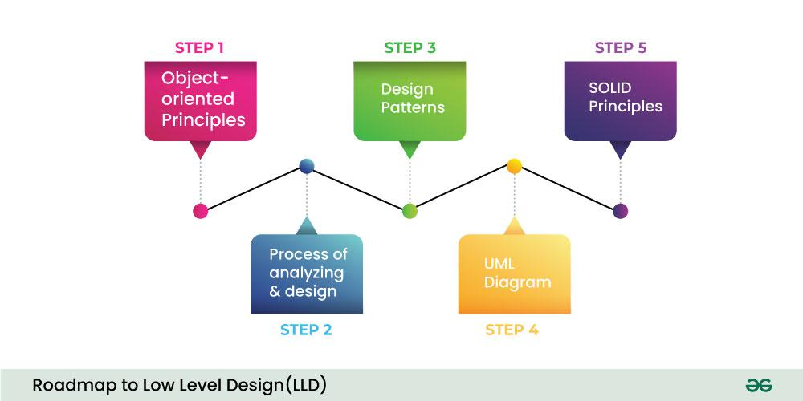

# Low Level Design

# 

> **`Note 1`**: Use  (recommended) in order to view the jupyter notebooks (nbviewer loads the notebook really fast compared to GitHub). You can see all the codes and the outputs in nbviwer without running the whole code again.

> **`Note 2`**: If you want to edit the notebooks and rerun cells, open notebooks in .

> **`Note 3`**: It has been observed that sometimes both  and  fail to properly render Table of Contents, animations and complex equations for some of the notebooks. In that case, render notebook in  itself.

## Status:

1. [LLD Foundations](01-LLD-Foundations) 
    1. OOP (Object Oriented Programming)    
2. [LLD Challenges](02-LLD-Challenges) 
    1. RailwayMate OOP Project    

