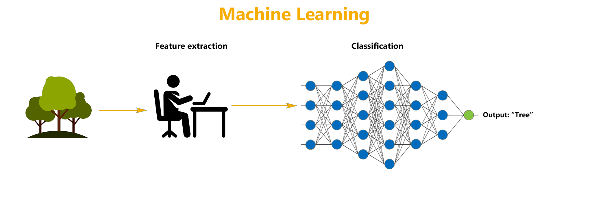

# 

> **`Note 1`**: Use  (recommended) in order to view the jupyter notebooks (nbviewer loads the notebook really fast compared to GitHub). You can see all the codes and the outputs in nbviwer without running the whole code again.

> **`Note 2`**: If you want to edit the notebooks and rerun cells, open notebooks in .

> **`Note 3`**: It has been observed that sometimes both  and  fail to properly render Table of Contents, animations and complex equations for some of the notebooks. In that case, render notebook in  itself.

## Status:

1. [Machine Learning Foundations](01-Machine-Learning-Foundations) 
    1. [Ancil's Pathway to Machine Learning Mastery: Complete Machine Learning Course from Ground-Up to Greatness](https://ancilcleetus.github.io/Pathway-to-Machine-Learning-Mastery) 
        1. Python for Machine Learning    
    2. [Google Machine Learning Crash Course](https://developers.google.com/machine-learning/crash-course) 
        1. Intro to Machine Learning    
        2. Supervised Learning    
        3. Linear Regression    
        4. Gradient Descent    
    3. [Microsoft Data Science For Beginners Course](https://microsoft.github.io/Data-Science-For-Beginners) 
    4. [Microsoft ML For Beginners Course](https://microsoft.github.io/ML-For-Beginners) 
2. [Machine Learning Projects](02-Machine-Learning-Projects) 
    1. Chicago Cab Fare Predictor using Linear Regression    

